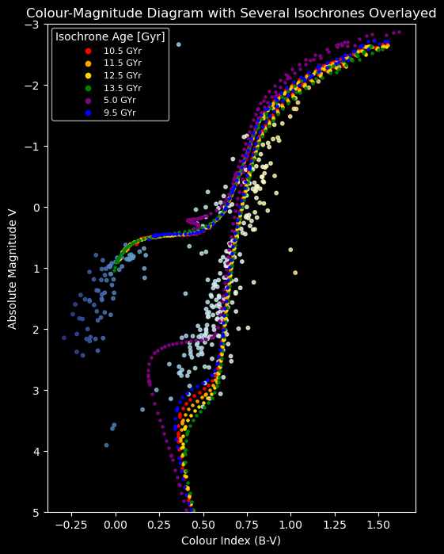

# Photometric Analysis and Age Determination of the Globular Cluster NGC 6341 (M92)

University of Birmingham Year 3 Observational Astronomy project. Using our own B- and V-band CCD images from the University of Birmingham Observatory's 20-inch Alluna telescope, we reduce the raw data, perform photometry, build a colour-magnitude diagram (CMD) of M92 and fit theoretical isochrones to estimate the cluster's age.

  

## Headline result

| | |
|---|---|
| **Estimated age of M92** | **11.5 ± 2 Gyr** (published value: 11.5 ± 0.5 Gyr) |
| Isochrone ages that fit the data | 10.5 to 13.5 Gyr (a 5 Gyr isochrone clearly does not) |
| Features recovered in the CMD | Red Giant Branch and Horizontal Branch |
| Main limitation | Data not deep enough to reach the main sequence turn-off (see below) |



## Why M92?

Globular clusters are among the oldest objects in the Galaxy, so their ages set a lower limit on the age of the Universe. M92 is a metal-poor halo cluster in Hercules, well placed for observation from Birmingham in late October to November, and its low metallicity makes it a good test case for stellar evolution models.

## Data

- **Telescope and camera:** University of Birmingham Alluna 20-inch Ritchey-Chrétien with an SBIG STX-16803 CCD (about 0.5° field of view, 0.467 arcsec/pixel)
- **Filters:** Johnson-Cousins B and V
- **V band:** 29 October 2025 (grey time), 30 × 300 s science frames, 25 used after removing frames affected by clouds and a cosmic ray
- **B band:** 19 November 2025 (dark time), 35 × 60 s science frames
- **Calibration frames:** 20 bias and 5 dark (30 s) frames per band, plus twilight flats (V flats from a different night were used after the original set was found to contain stars)

## Method

1. **Data reduction** (`ccdproc`, `astropy`): bias, dark and flat-field correction; frames checked individually in DS9 for clouds and cosmic rays; median-combined master frames.
2. **Alignment and stacking** (`astroalign`): frames aligned using the brightest stars to correct tracking drift, then the B stack aligned onto the V stack.
3. **Source detection** (`photutils`): 2D background model (512 × 512 boxes, 3σ clipping), thresholded segmentation and deblending. The V band found 1,285 sources and the B band 1,826.
4. **Cross-matching** (`scipy.spatial.cKDTree`): 535 stars matched between bands within 1.5 px, 287 of them in an annulus (215 to 775 px from the cluster centre) chosen to avoid the blended core and a bright foreground star.
5. **Calibration:** fixed 4.5 px aperture photometry with local sky correction, calibrated to apparent magnitudes using the standard star HD 156964, giving zero points of ZP_V = 26.204 ± 0.003 and ZP_B = 24.650 ± 0.003 (extinction and airmass corrected).
6. **Reddening correction:** E(B−V) = 0.025 ± 0.010 and A_V = 0.062 mag.
7. **Isochrone fitting:** PARSEC isochrones at Z = 0.0001 ([Fe/H] = −2.3), shifted by a distance modulus of 14.6 ± 0.1 (d = 8.231 ± 0.347 kpc), compared across a range of ages by eye.

## Limitations (and what I would do next)

- **No main sequence turn-off.** The V-band 5σ limit is at V ≈ 17.4, while M92's turn-off sits near V ≈ 18.5. The age is therefore constrained mainly by the red giant branch, which is less sensitive to age, so the ±2 Gyr uncertainty is larger than a turn-off fit would give.
- **No formal fit.** Ages were judged by overlaying isochrones; a least-squares fit was not done because of time constraints.
- **Crowded core.** Aperture photometry cannot separate blended stars, so the inner 215 px were excluded.
- **Background stars** in the annulus were not removed (no membership selection).
- **Next steps:** PSF photometry (e.g. DAOPHOT or `photutils` PSF fitting) for the crowded core, more V-band frames to reach the turn-off, proper membership selection, and a quantitative isochrone fit.

## Repository contents

| File / folder | Description |
|---|---|
| `NGC_6341 Data Analysis.ipynb` | Full analysis notebook: master frames, stacking, source extraction, flux calibration, CMD plots, sensitivity calculation |
| `Globular Cluster M92 Final Report.pdf` | Full write-up: methods, results, discussion |
| `M92 Observing Proposal.pdf` | Observing proposal written before the observations |
| `NGC_6341 Data/` | Calibration frames, science frames and master frames in `B-band/` and `V-band/` subfolders, plus `Isochrones/` (PARSEC `.dat` files) |

## Running the notebook

Requirements: Python 3, Jupyter, and `numpy`, `pandas`, `scipy`, `matplotlib`, `astropy`, `ccdproc`, `photutils`, `astroalign`.

```bash
git clone https://github.com/sahilshah-05/Observational-Labs-GlobularCluster.git
cd Observational-Labs-GlobularCluster
pip install numpy pandas scipy matplotlib astropy ccdproc photutils astroalign jupyter
jupyter notebook "NGC_6341 Data Analysis.ipynb"
```

Run it from the repository root, as it reads data using relative paths such as `NGC_6341 Data/V-band/Master Frames/`.

## Skills demonstrated

- CCD data reduction and calibration (bias, dark, flat-field correction)
- Image registration and stacking
- Source detection, deblending and aperture photometry in crowded fields
- Photometric calibration with a standard star and extinction correction
- Colour-magnitude diagram analysis and isochrone fitting
- Honest assessment of data quality, SNR limits and systematic uncertainties
- Scientific writing and reproducible analysis in Python

## Author

**Sahil Shah**: [GitHub](https://github.com/sahilshah-05) · [LinkedIn](https://linkedin.com/in/sms-sahilshah/)

University of Birmingham, School of Physics and Astronomy, 2025.
